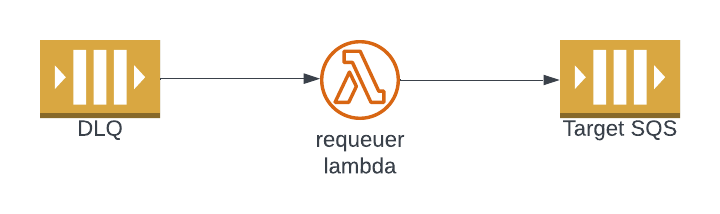

## What it is?
This is an AWS serverless application to retry failed messages ends up in the DLQ. The consumer responsible for processing messages from event sources such as SQS, SNS, Eventbridge, etc. may fail to process a valid message for reasons such as temporary downstream service failures. Typically if the evert source is SQS or the other type of event source's consumer is lambda function and it is invoked asynchronously, a DLQ can be configured send the messages that are failed. When the downstream server is back, we need to reprocess the messages in the DLQ.

It is necessary to automate the process of reprocessing the messages in the DLQ. As illustrated in diagram below, the solution propose of replaying the DLQ messages using a requeuer lambda function which send the message message to target SQS. The consumer can receive the message from the target SQS and reprocess the message again.


## What is it for?
Modern applications with event driven architecture have many event sources and consumers. It is likely that such systems would have a DLQ and there is need to reprocess the messages ends up in the DLQ. This application can be published to the AWS Serverless Application Repository to enable reusability of the code. The application can also be shared to pubic or other AWS accounts.

## How to use it?

Given that the application is published to the AWS Serverless Application Repository, it can deployed in the AWS using the following SAM template

```yaml
AWSTemplateFormatVersion: '2010-09-09'
Transform: AWS::Serverless-2016-10-31
Resources:
  RequeuerApp:
    Type: AWS::Serverless::Application
    Properties:
      Location:
        ApplicationId: arn:aws:serverlessrepo:{aws-region}:{aws-account-id}:applications/{application-name}
        SemanticVersion: 1.0.0
      Parameters:
        DLQName: sample-dlq
        TargetSQSName: app-sqs
```

## How to deploy?

Publishing the application to the Serverless Application Repository cab found in https://docs.aws.amazon.com/serverless-application-model/latest/developerguide/serverless-sam-template-publishing-applications.html
